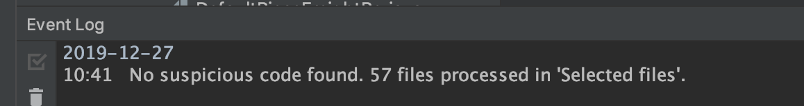

# oomall

### 2019.12.27 补充说明

1. 最开始用的是IDEA自动生成的GET、SET、TOSTRING、HASHCODE方法，由于需要频繁更新Domain，每改一个属性，就需要删除原本的方法，再重新自动生成，所以后来改为了lombok的@GETTER、@SETTER等注解方式，会在运行时自动创建该类方法

2. lombok的注解使用时，有同学反映会有红线提示，可以通过在IDEA的 设置->插件->搜索Lombok->install->重启IDEA 解决。没有安装该插件并不会影响正常编译（虽然报了红线提示。

   另外说明一点不使用IDEA自带的自动生成代码的比较重要的原因，domain中有通过extend得到的对象，extend出来的对象通过自动生成的代码是过不了**阿里规约**的（感谢2-1小组的提醒

3. 最后附上一张阿里规约检查

### 2019.12.6 更新日志

- 修复了代码中命名规范的问题（is前缀改为了be，代码注释要符合阿里规约格式的注释），通过阿里规约检查
- order_item中新增3个属性goods_id, name_with_specifications（商品名+选择的产品规格的文字）,pic_url属性，作为订单部分冗余的快照，记录下单时刻买的商品（含规格）的名称和图片
- 新增role和privilige表（管理员角色表和权限表）
- address添加一个收件人consignee属性
- admin表添加一个role_id属性，表示他的角色（为了简化查询，设定是一个管理员一个角色，一个角色多个权限）
- aftersales_service表里添加一个属性status，用来表示管理员的审核状态，0表示未审核，1表示审核通过，2表示审核拒绝
- Share_item漏加了success_num属性已补全

### 2019.12.7 更新日志

- address表删除了原本省市县的字符串，而是改成了记录省id、市id、县id，用到时到region表查
- be_shared_item表在数据库中补上了漏加的goods_id属性
- coupon在数据库中补上了漏加的status属性（表示是否被用过）
- 售后的domain代码中更新了注释描述，增加了userid字段

### 2019.12.8 更新日志

- couponRule里删除原本的discount和limit属性，改为strategy的json字符串，以满足多方式的优惠策略的实现

- 补充属性说明，售后中的goods_type指对应的order_item中的商品是正常的、团购的还是预售的

- 售后表新增属性product_id（针对组合产品单换）

- Default_piece_freight表补全数据库漏掉的属性：预计送达时长 

- 新增presale_rule表，用于存储预售的内容（预售针对具体产品）

### 2019.12.9 更新日志

- goods新增price属性用于显示该商品的最低价格
- goods的status从Bool变更为int类型
- goods_category增加pic_url属性
- 修复order中ship channel的类型为字符串（尽管可能后续用不到）
- user补全原本漏掉的一个getUserLevel的方法
- user增加role_id，区分不同角色的用户，来做权限验证（说明：privilege表中的name可以用来存储url，具体实现各组可自定义）
- **添加data.sql文件用于插入基本数据**

### 2019.12.10 更新日志

- presale由product_id改为goods_id，是针对商品

### 2019.12.12 更新日志

- 由于删除组合产品需求，删除product中的product_ids属性

- 同上理由，删除售后中的product_id属性

- 由于没有对专题的评论，删除topic中type

- 满足高并发需求，coupon_rule表添加collected_num属性表示已领取的优惠券数量

- 由于分享规则改为永久有效，删除share_rule中与时间有关的开始时间和结束时间两个属性

- **更新数据字典**

- **为所有数字类型增加列举所有可能的属性，并规定其对应的数值**(代码需在协商后再上传)

- **为所有JSON添加了注释，说明JSON存储的格式**(代码需在协商后再上传)

- 说明，**所有的JSON格式中的数字也带引号**，解析时照字符串解析，eg.数据库会存储{"size":"40"}，而不会存储{"size":40}

- ### 重要更新说明！！！

  ##### 应老师要求，由标准组统一制定模块间传输的对象和属性，而不再需要每组自己定义传输属性；

  ##### 模块组将会选择以对象模型组写好的不同的对象来作为传输标准。

### 2019.12.14 更新日志

- 需求增加了不同的返点规则，故修改了ShareRulePo中的strategyJSON格式（见代码注释），ShareRule增加type字段
- 数据库sql中返点的success_num由smallint改为bigint类型
- **为避免关键字问题，所有的表名统一加了“oomall_”前缀**
- 为避免关键字问题，Log表中的action改名为actions
- 权限表的name字段存在JSON解析慢的问题，故拆成了url和method两个字段

### 2019.12.15 更新日志

- 补上了sql中order_item误删的pic_url属性
- 更新了sql的基础数据

### 2019.12.16 更新日志

- Order中添加paymentList，用于处理预售
- 修复Product.java出现的编码问题
- Payment的sql中is_successful改为status，domain中改为statusCode，0未支付，1成功，2失败

### 2019.12.17

- payment为了支持退款，sql中的付款金额取消unsigned(违背阿里规约)，以支持负数的退款
- couponPo中statusCode属性类型改为Integer
- couponRule中sql添加status属性（解决管理员强行下架优惠券规则），domain中同理添加该属性

### 2019.12.18
- 规范了命名
- 定义了pom文件（需要自己改，不用可以删除）

